# 淡水鱼低代码开发平台

<p align=center>
  
</p>
<p align=center>
   淡水鱼低代码开发平台，一个基于springboot,springSecurity,redis等开发的后台管理脚手架
</p>
<p align="center">
<a target="_blank" href="https://gitee.com/tu_xu_chen/freshwater">
		</img>
        </img>
        </img>
        </img>
        </img>
        </img>
</a></p>

## 项目介绍

淡水鱼低代码开发平台是基于代码生成器的`低代码开发平台`,采用`springboot`,`springSecurity`,`redis`等开发的后台管理脚手架,搭配代码生成器,便于快速开发,

帮助解决Java项目70%的重复工作，让开发更多关注业务。既能快速提高效率，节省研发成本，同时又不失灵活性！

淡水鱼低代码开发平台提供一系列低代码模块,实现动态表结构生成,后端基础CURD代码生成,插件能力（可插拔）等等！

## 项目特点

- 友好的代码结构及注释，便于阅读及二次开发
- 实现前后端分离，通过 **Json** 进行数据交互，前端再也不用关注后端技术
- 在**mybatisPuls**的基础上自定义代码生成器,便于快速开发
- 引入 **RBAC** 权限管理设计，灵活的权限控制，按钮级别的细粒度权限控制，满足绝大部分的权限需求
- 采用**自定义参数校验注解**，轻松实现后端参数校验
- 采用maven分模块开发方式
- 专业接口对接机制，统一采用restful接口方式，集成swagger-ui在线接口文档，Jwt token安全验证，方便客户端对接

## 技术选型

| 技术           | 说明             | 官网                                                         |
| -------------- | ---------------- | ------------------------------------------------------------ |
| SpringBoot     | MVC框架          | [https://spring.io/projects/spring-boot](https://spring.io/projects/spring-boot) |
| SpringSecurity | 认证和授权框架   | https://spring.io/projects/spring-security                   |
| MyBatis-Plus   | ORM框架          | https://mp.baomidou.com/                                     |
| Swagger-UI     | 文档生产工具     | https://github.com/swagger-api/swagger-ui                    |
| Redis          | 分布式缓存       | https://redis.io/                                            |
| Druid          | 数据库连接池     | https://github.com/alibaba/druid                             |
| JWT            | JWT登录支持      | https://github.com/jwtk/jjwt                                 |
| Lombok         | 简化对象封装工具 | https://github.com/rzwitserloot/lombok                       |
| SLF4J          | 日志框架         | http://www.slf4j.org/                                        |

## 项目目录结构


```bash
项目结构
|freshwater(父级pom)
|--doc(sql文件,数据库表设计,项目附件)
|--freshwater-commons(公共包-提供公用的工具类,枚举等等)
|--freshwater-file(文件包-提供文件上传下载等文件接口)
|--freshwater-generator(代码生成器模块-基于freemarker的代码生成器)
|--freshwater-rbac(权限模块-基于rabc模型实现,提供注册登录菜单角色等接口)
|--freshwater-template(动态表模块-实现动态表结构生成,降低业务代码开发)
|--freshwater-web(主启动类模块,springBoot主启动类存放位置)
```


## 版本说明

**Maven版本:** [项目地址](https://gitee.com/tu_xu_chen/freshwater)


**Gradle版本:**

## 账号密码

```bash
username:admin
password:1234WD

swagger地址:
http://localhost:4329/doc.html
```

## RBAC权限模块说明

目前`master`版本分支下的项目,默认使用`Security`自带的session认证,如果想开启`JWTtoken`认证,请将如下配置代码放行:


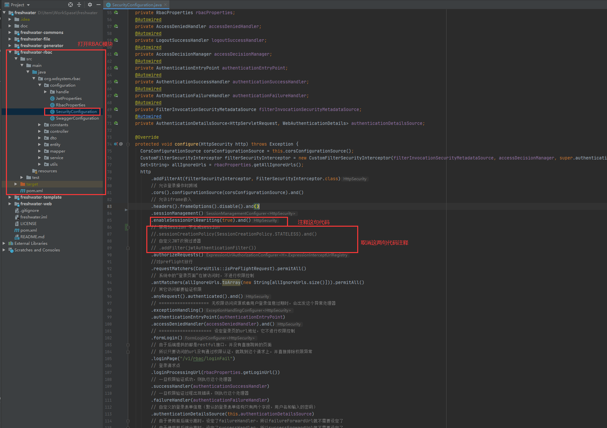


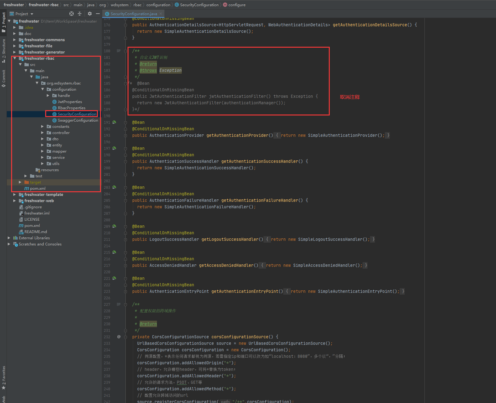


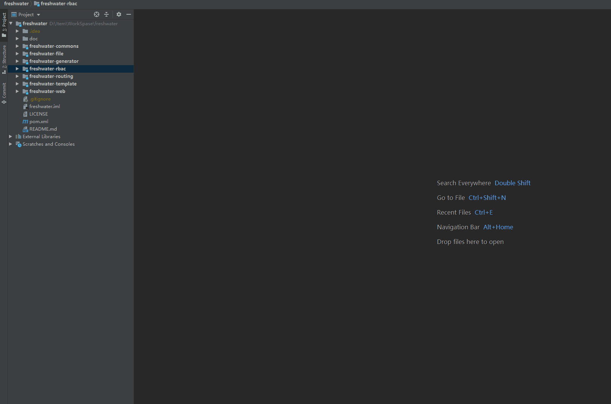


## 动态表模块说明

### 模块功能说明

动态表模块是可以根据前端传入的`json`,根据参数动态生成数据库表结构,如果需要还可以同时生成后端代码文件~


如果只是简单的增删查改,完全可以不生后端代码,前端只需要调用我们项目提高的接口,做到后端零代码开发~


### 模块功能演示

1.创建学生表

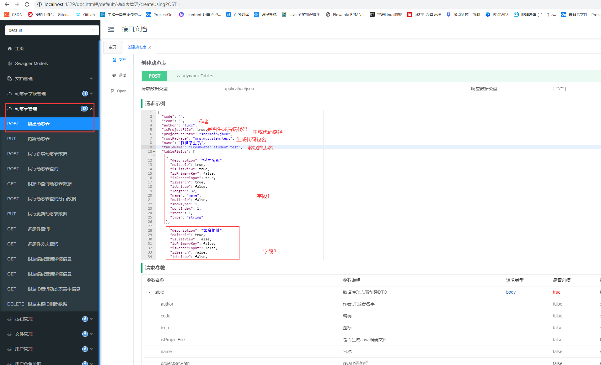


**特别说明: 生成代码出现报错是由于生成路径没有加上子项目名称,请在`  "projectSrcPath": "src/main/java",` 字段值前加上需要子项目名称**

如:`projectSrcPath": "freshwater-template/src/main/java`


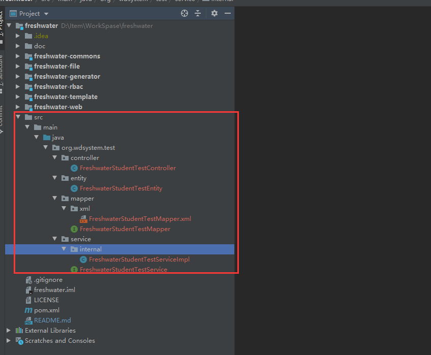


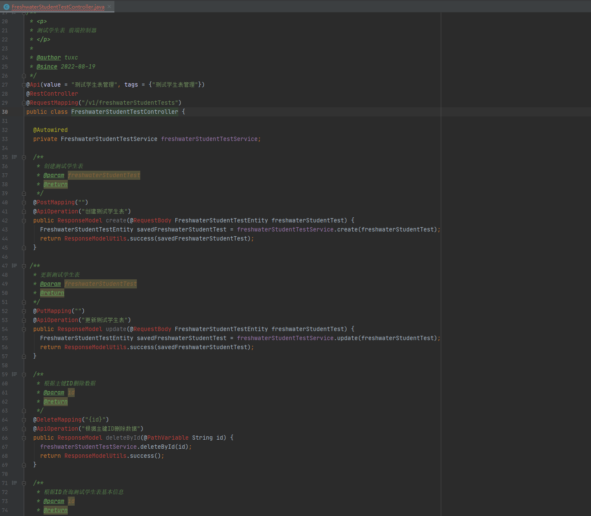


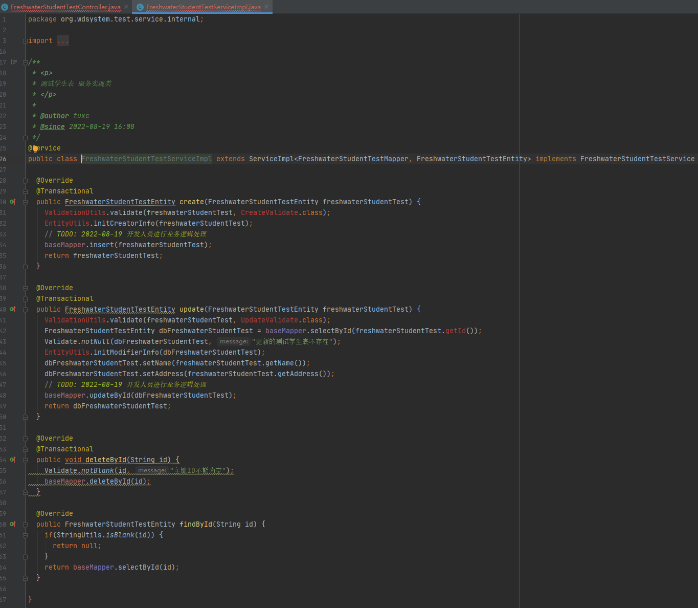


生成的数据库表


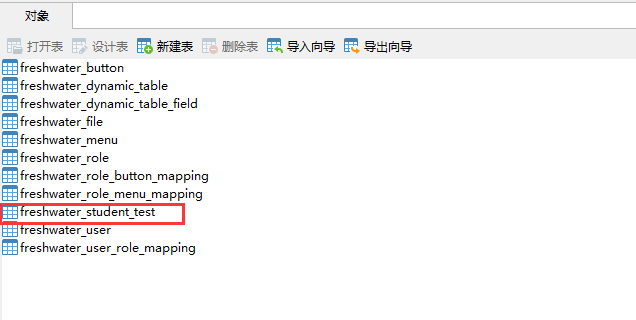

除了用户定义的字段,也有一些默认字段


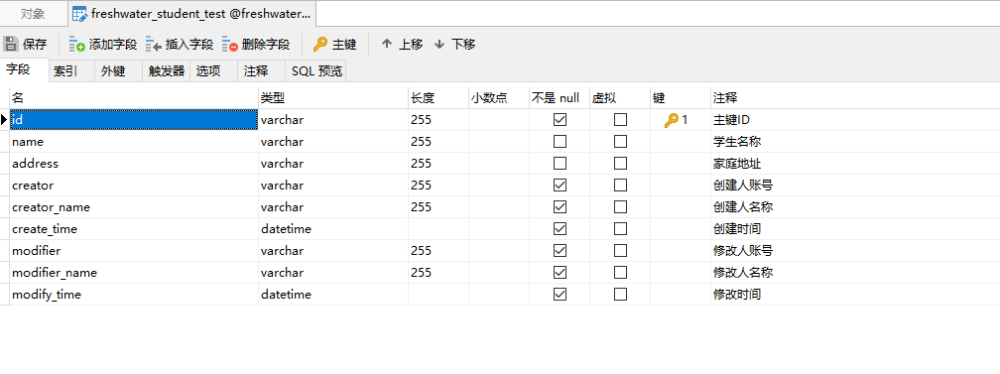


2.调用执行接口,往动态表内写入数据


简单的CURD可以直接调用项目提供的**执行系列** 接口


如调用新增:传入新增字段名和值


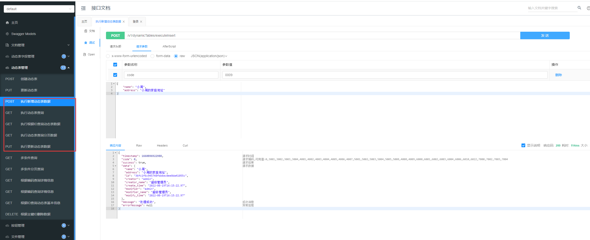


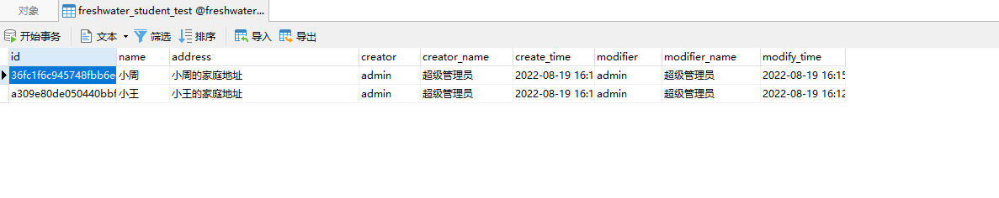

其他基础查询可以调用相关查询接口


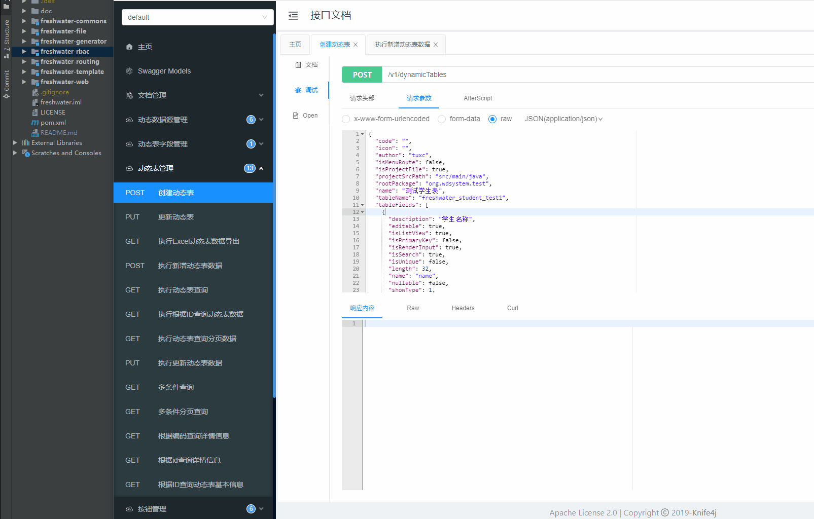

## 数据库设计

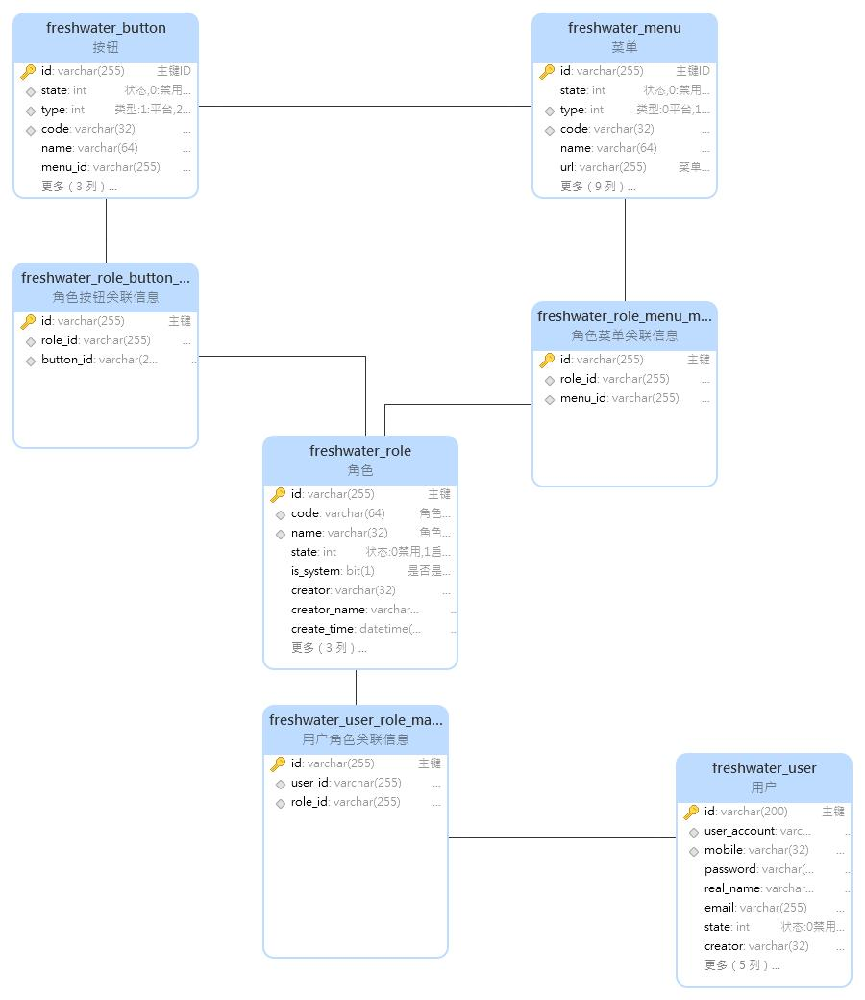

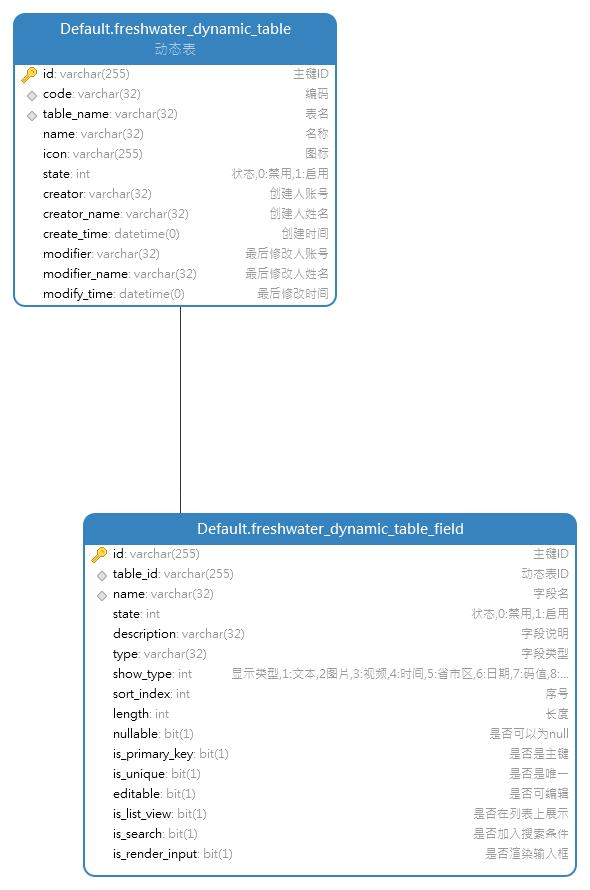


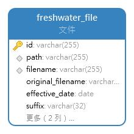


## 未来计划

- [x] 多数据源：及其简易的使用方式，在线配置数据源配置，便捷的从其他数据抓取数据
- [ ] 集成工作流activiti，并实现了只需在页面配置流程转向，可极大的简化bpm工作流的开发；用bpm的流程设计器画出了流程走向，一个工作流基本就完成了，只需写很少量的java代码
- [x] 简易Excel导入导出
- [ ] 消息中心（支持短信、邮件、微信推送等等）
- [ ] 动态定时任务
